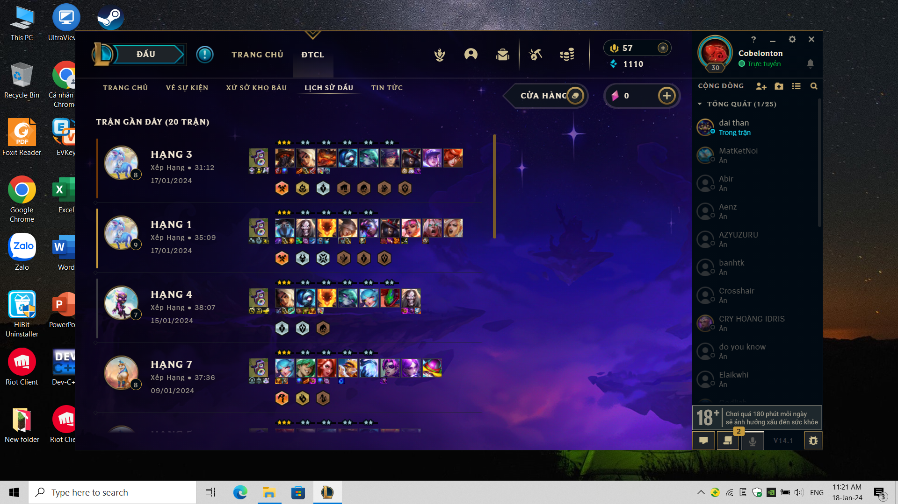

## Dự án ESP32 Đọc Cảm Biến Ánh Sáng (LDR) và Hiển Thị Trên Teleplot

Dự án này minh họa cách sử dụng **ESP32** để đọc cường độ ánh sáng từ **cảm biến quang trở (LDR)** thông qua **chân ADC (GPIO39)** và hiển thị dữ liệu **theo thời gian thực** bằng **Teleplot** trong Visual Studio Code.

---

## Tính năng chính

- Đọc giá trị cường độ ánh sáng (từ 0 – 4095)
- Gửi dữ liệu qua cổng Serial theo định dạng tương thích với Teleplot (`>Light:giatri`)
- Hiển thị đồ thị ánh sáng theo thời gian thực trong VS Code
- Dự án đơn giản, phù hợp cho người mới bắt đầu tìm hiểu về ADC và trực quan hóa dữ liệu cảm biến

---

## Sơ đồ phần cứng

| Linh kiện | Kết nối |
|------------|----------|
| LDR | Một chân nối vào GPIO39, chân còn lại nối 3.3V |
| Điện trở (10kΩ) | Nối giữa GPIO39 và GND |
| ESP32 | Kết nối với máy tính qua cáp USB |

**Nguyên lý:**  
LDR và điện trở tạo thành **mạch chia áp**, điểm giữa nối vào GPIO39 để ESP32 đọc điện áp tỷ lệ với cường độ ánh sáng.

---

## Ảnh minh họa kết quả trên Teleplot

*Hình trên hiển thị đồ thị cường độ ánh sáng theo thời gian, được vẽ tự động bởi Teleplot.*

---
